# Go-Spring

[![GoDoc][1]][2] [![Build Status][7]][8] [![Release][5]][6] [![license-Apache 2][3]][4]

[1]: https://godoc.org/github.com/go-spring-projects/go-spring?status.svg
[2]: https://godoc.org/github.com/go-spring-projects/go-spring
[3]: https://img.shields.io/badge/license-Apache%202-blue.svg
[4]: LICENSE
[5]: https://img.shields.io/github/v/release/go-spring-projects/go-spring?color=orange
[6]: https://github.com/go-spring-projects/go-spring/releases/latest
[7]: https://github.com/go-spring-projects/go-spring/workflows/Go%20Test/badge.svg?branch=master
[8]: https://github.com/go-spring-projects/go-spring/actions?query=branch%3Amaster


`Go-Spring` vision is to empower Go programmers with a powerful programming framework similar to Java `Spring`. It is dedicated to providing users with a simple, secure, and reliable programming experience.

### Install
`go get github.com/go-spring-projects/go-spring@latest`

### IoC container

In addition to implementing a powerful IoC container similar to Java Spring, Go-Spring also extends the concept of beans. In Go, objects (pointers), arrays, maps, and function pointers can all be considered beans and can be placed in the IoC container.

| Java Spring 				                      | Go-Spring			                   |
|:--------------------------------------|:-------------------------------|
| `@Value` 								                     | `value:"${}"` 				             |
| `@Autowired` `@Qualifier` `@Required` | `autowire:"?"` 				            |
| `@Configurable` 						                | `WireBean()` 					             |
| `@Profile` 							                    | `ConditionOnProfile()` 		      |
| `@Primary` 							                    | `Primary()` 					              |
| `@DependsOn` 							                  | `DependsOn()` 				             |
| `@ConstructorBinding` 				            | `RegisterBeanFn()` 			         |
| `@ComponentScan` `@Indexed` 			       | Package Import 				            |
| `@Conditional` 						                 | `NewConditional()` 			         |
| `@ConditionalOnExpression` 			        | `NewExpressionCondition()` 	   |
| `@ConditionalOnProperty` 				         | `NewPropertyValueCondition()`	 |
| `@ConditionalOnBean` 					            | `NewBeanCondition()` 			       |
| `@ConditionalOnMissingBean` 			       | `NewMissingBeanCondition()`	   |
| `@ConditionalOnClass` 				            | Don't Need 					               |
| `@ConditionalOnMissingClass` 			      | Don't Need 					               |
| `@Lookup` 							                     | —— 							                     |

### How to use

> Golang does not support annotations, bean registration needs to be written code. And due to the package trimming, you must import the package to ensure that the registration code is executed correctly.

#### Hello world

```go
package main

import (
	"log/slog"

	"github.com/go-spring-projects/go-spring/gs"
)

type MyApp struct {
    Logger *slog.Logger `logger:""`
}

func (m *MyApp) OnInit(ctx gs.Context) error {
    m.Logger.Info("Hello world")
    return nil
}

func (m *MyApp) OnDestroy() {
}

func main() {
    // register object bean
    gs.Object(new(MyApp))
	
    // run go-spring boot app
    gs.Run()
}

// Output:
// time=2023-09-25T14:50:32.927+08:00 level=INFO source=main.go:14 msg="Hello world" logger=go-spring type=main.MyApp
```

#### Bean register

```go
package mypkg

type MyApp struct {}

type NewApp() *MyApp {
	return &MyApp{}
}

func init() {
	// register object bean
	gs.Object(&MyApp{})
	
	// or
	
	// register method bean: bean created from the registration method.
	gs.Provide(NewApp) 
}
```

#### Annotations syntax

Property binding and bean injection annotations are marked using struct field tags.

##### Property binding

Bind properties to a value, the bind value can be primitive type, map, slice, struct. When binding to struct, the tag 'value' indicates which properties should be bind. The 'value' tags are defined by value:"${a:=b}", 'a' is the property name, 'b' is the default value.



##### Dependency Injection

Dependency Injection is a design pattern used to implement decoupling between classes and the management of dependencies. It transfers the responsibility of creating and maintaining dependencies to an external container, so that the class does not need to instantiate dependent objects itself. Instead, the external container dynamically injects the dependencies.


### Conditional registering

According to the conditions specified at registration, you can control whether the Bean is effective.

```
func OnBean(selector BeanSelector) 
func OnExpression(expression string)
func OnMatches(fn func(ctx Context) (bool, error)) 
func OnMissingBean(selector BeanSelector) 
func OnMissingProperty(name string) 
func OnProfile(profile string)
func OnProperty(name string, options ...PropertyOption)
func OnSingleBean(selector BeanSelector) 
```

### Property binding

`Go-Spring` not only supports property binding for primitive data types but also supports property binding for custom value types. It also provides support for nested binding of struct properties.

```go
type DB struct {
	UserName string `value:"${username}"`
	Password string `value:"${password}"`
	Url      string `value:"${url}"`
	Port     string `value:"${port}"`
	DB       string `value:"${db}"`
}

type DbConfig struct {
	DB []DB `value:"${db}"`
}
```

The above code can be bound using the following configuration：

```yaml
db:
  -
    username: root
    password: 123456
    url: 1.1.1.1
    port: 3306
    db: db1
  -
    username: root
    password: 123456
    url: 1.1.1.1
    port: 3306
    db: db2
```

### Dynamic property

Allows dynamically refresh properties during runtime, not only supporting basic data types, but also structures, slices, and Map types.

```go
type RateLimiter struct {
	Enable      dync.Bool           `value:"${limiter.enabled:=false}"`
	Rate        dync.Int32          `value:"${limiter.rate:=5}"`
	Capacity    dync.Int32          `value:"${limiter.capacity:=10}"`
	Excludes    dync.Array[string]  `value:"${limiter.excludes:=}"`
}
```

### Structured logger

Automatically injects named logger, the logger library powered by the std [slog](https://pkg.go.dev/log/slog).

```go
type Server struct {
	Logger      *slog.Logger `logger:""`                        // primary logger
	TraceLogger *slog.Logger `logger:":trace"`                  // customize logger `trace`
	SysLogger   *slog.Logger `logger:"${server.sys-logger}"`    // logger picker by config
}
```

### Dependent order event

Initialization and deinitialization based on dependency order, everything will be executed as expected.




### Acknowledgement
This project initial code based from [go-spring/go-spring](https://github.com/go-spring/go-spring) created by [lvan100](https://github.com/lvan100)

### License

The `Go-Spring` is released under version 2.0 of the Apache License.
