# Go-Spring

[![GoDoc][1]][2] [![Build Status][7]][8] [![Codecov][9]][10] [![Release][5]][6] [![license-Apache 2][3]][4]

[1]: https://godoc.org/github.com/go-spring-projects/go-spring?status.svg
[2]: https://godoc.org/github.com/go-spring-projects/go-spring
[3]: https://img.shields.io/badge/license-Apache%202-blue.svg
[4]: LICENSE
[5]: https://img.shields.io/github/v/release/go-spring-projects/go-spring?color=orange
[6]: https://github.com/go-spring-projects/go-spring/releases/latest
[7]: https://github.com/go-spring-projects/go-spring/workflows/Go%20Test/badge.svg?branch=master
[8]: https://github.com/go-spring-projects/go-spring/actions?query=branch%3Amaster
[9]: https://codecov.io/gh/go-spring-projects/go-spring/graph/badge.svg?token=BQ6OKWWOF0
[10]: https://codecov.io/gh/go-spring-projects/go-spring


`Go-Spring`的愿景是为Go程序员提供类似于Java `Spring`的强大编程框架。致力于为用户提供简单、安全、可靠的编程体验。

本项目初始代码基于 [go-spring/go-spring](https://github.com/go-spring/go-spring) 由 [lvan100](https://github.com/lvan100) 创建。

[English](README.md) | 中文  

### 安装
`go get github.com/go-spring-projects/go-spring@latest`

### 主要特性
* **IoC容器**: 实现了基于反射的控制反转(IoC)容器，支持结构体、函数和常量的注入。这意味着你可以使用`autowired`标签来自动注入依赖，而不必手动管理它们。
* **配置管理**: 受Spring的@Value注释的启发，Go-Spring允许您从多个源(如环境变量、文件、命令行参数等)获取配置项。这为配置管理带来了前所未有的灵活性。
* **配置验证器**: 通过支持自定义验证器扩展扩展了其健壮的配置管理功能。这使您能够对属性执行有效性检查，确保仅将有效的配置应用于您的应用程序。
* **结构化日志**: 使用标准库slog提供内置日志记录器支持，以实现有效和简化的日志记录。这种增强提供了清晰、简洁和结构良好的日志信息，有助于系统调试和性能监视。
* **动态属性**: 提供动态属性刷新功能，让您无需重新启动应用程序即可动态更新应用程序属性。它满足了需要高可用性和实时响应的应用程序的需求。
* **依赖序事件**: 按照bean依赖关系的顺序，确保根据对象的生命周期正确通知初始化和销毁事件。这增强了系统在其生命周期运行中的鲁棒性和可靠性。

### IoC 容器

除了实现类似于Java Spring的强大的IoC容器之外，Go-Spring还扩展了bean的概念。在Go中，对象(指针)、数组、Map和函数指针都可以被视为bean，并且可以放置在IoC容器中。

| Java Spring 				                      | Go-Spring			                   |
|:--------------------------------------|:-------------------------------|
| `@Value` 								                     | `value:"${}"` 				             |
| `@Autowired` `@Qualifier` `@Required` | `autowire:"?"` 				            |
| `@Configurable` 						                | `WireBean()` 					             |
| `@Configuration`                      | `Configuration()`              |
| `@Profile` 							                    | `ConditionOnProfile()` 		      |
| `@Primary` 							                    | `Primary()` 					              |
| `@DependsOn` 							                  | `DependsOn()` 				             |
| `@ConstructorBinding` 				            | `RegisterBeanFn()` 			         |
| `@ComponentScan` `@Indexed` 			       | Package Import 				            |
| `@Conditional` 						                 | `NewConditional()` 			         |
| `@ConditionalOnExpression` 			        | `NewExpressionCondition()` 	   |
| `@ConditionalOnProperty` 				         | `NewPropertyValueCondition()`	 |
| `@ConditionalOnBean` 					            | `NewBeanCondition()` 			       |
| `@ConditionalOnMissingBean` 			       | `NewMissingBeanCondition()`	   |
| `@ConditionalOnClass` 				            | Don't Need 					               |
| `@ConditionalOnMissingClass` 			      | Don't Need 					               |
| `@Lookup` 							                     | —— 							                     |

### 如何使用

> Golang不支持注解，需要编写bean注册代码。由于包裁剪，您必须导入包以确保正确执行注册码。

#### Hello world

```go
package main

import (
	"context"
	"log/slog"

	"github.com/go-spring-projects/go-spring/gs"
)

type MyApp struct {
	Logger *slog.Logger `logger:""`
}

func (m *MyApp) OnInit(ctx context.Context) error {
	m.Logger.Info("Hello world")
	return nil
}

func main() {
	// register object bean
	gs.Object(new(MyApp))

	// run go-spring boot app
	gs.Run()
}

// Output:
// time=2023-09-25T14:50:32.927+08:00 level=INFO source=main.go:14 msg="Hello world" logger=go-spring
```

#### Bean register

```go
package mypkg

import "github.com/go-spring-projects/go-spring/gs"

type MyApp struct {}

func NewApp() *MyApp {
	return &MyApp{}
}

func init() {
	// register object bean
	gs.Object(&MyApp{})
	
	// or
	
	// register method bean: bean created from the registration method.
	gs.Provide(NewApp) 
}
```

#### 注解语法

属性绑定和bean注入注释使用结构标签记进行标记。

##### 属性绑定

将属性绑定到一个值，绑定的值可以是基础类型、Map、切片、结构体。当绑定到struct时，标签`value`指示应该绑定哪些属性。`value`标签由`value:"${a:=b}"`定义，`a`是属性名，`b`是默认值。



##### 依赖注入

依赖注入是一种设计模式，用于实现类之间的解耦和依赖项的管理。它将创建和维护依赖关系的责任转移到外部容器，这样类就不需要实例化依赖对象本身。相反，外部容器会动态注入依赖项。



### 条件注册

根据注册时指定的条件，您可以控制Bean是否有效。

```
func OnBean(selector BeanSelector) 
func OnExpression(expression string)
func OnMatches(fn func(ctx Context) (bool, error)) 
func OnMissingBean(selector BeanSelector) 
func OnMissingProperty(name string) 
func OnProfile(profile string)
func OnProperty(name string, options ...PropertyOption)
func OnSingleBean(selector BeanSelector) 
```

### 属性数据源

`Go-Spring`不仅支持基本数据类型的属性绑定，还支持自定义值类型的属性绑定。它还支持结构属性的嵌套绑定。

内置配置数据源支持基于本地文件系统，并建立了`.yaml` `.properties` `.toml`的数据格式的支持。

默认情况下，我们将尝试从`./config/`加载所有支持的文件格式, 根据以下优先级级别加载:
1. 加载 `./config/application.{yaml|properties|toml}`。
2. 加载 `./config/application-{profiles}.{yaml|properties|toml}`。
3. 加载前缀为`GS_`的环境变量。
4. 加载命令行参数 `-D key=value`。

配置加载得越早，优先级越低，这意味着它可能会被具有更高优先级的后续配置覆盖。

```go
type DBOptions struct {
	UserName string `value:"${username}"`
	Password string `value:"${password}"`
	IP       string `value:"${ip}"`
	Port     string `value:"${port}"`
	DB       string `value:"${db}"`
}

type DbConfig struct {
	DB []DBOptions `value:"${db}"`
}
```

可以使用以下配置绑定上述代码：

```yaml
db:
  -
    username: root
    password: 123456
    ip: 1.1.1.1
    port: 3306
    db: db1
  -
    username: root
    password: 123456
    ip: 1.1.1.1
    port: 3306
    db: db2
```

### 属性校验器

`Go-Spring`允许您注册自定义值验证器。如果值验证失败，则`Go-Spring`将在启动阶段报告一个错误。

在这例子中, 我们将使用 [go-validator/validator](https://github.com/go-validator/validator), 您可以参考这个示例来注册您的自定义验证器。

```go
package main

import (
	"context"
	"fmt"
	"log/slog"

	"github.com/go-spring-projects/go-spring/conf"
	"github.com/go-spring-projects/go-spring/gs"
	"gopkg.in/validator.v2"
)

const validatorTagName = "validate"

type validatorWrapper struct {
	validator *validator.Validator
}

func (v *validatorWrapper) Field(tag string, i interface{}) error {
	if 0 == len(tag) {
		return nil
	}
	return v.validator.Valid(i, tag)
}

func init() {
	conf.Register(validatorTagName, &validatorWrapper{validator: validator.NewValidator().WithTag(validatorTagName)})
}

//--------------------------------------------------------------------------

type DBOptions struct {
	UserName string `value:"${username}"`
	Password string `value:"${password}"`
	IP       string `value:"${ip}"`
	Port     int32  `value:"${port}" validate:"min=1024,max=65535"`
	DB       string `value:"${db}" validate:"nonzero"`
}

type MysqlDatabase struct {
	Logger  *slog.Logger `logger:""`
	Options DBOptions    `value:"${db}"`
}

func (md *MysqlDatabase) OnInit(ctx context.Context) error {
	md.Logger.Info("mysql connection summary",
		"url", fmt.Sprintf("mysql://%s:%s@%s:%d/%s", md.Options.UserName, md.Options.Password, md.Options.IP, md.Options.Port, md.Options.DB))
	return nil
}

func main() {

	gs.Property("db.username", "admin")
	gs.Property("db.password", "123456")
	gs.Property("db.ip", "127.0.0.1")
	gs.Property("db.port", "0") // set db.port=0
	gs.Property("db.db", "test")

	gs.Object(new(MysqlDatabase))

	if err := gs.Run(); nil != err {
		panic(err)
	}
}

//
// Output:
// panic: container refresh failed
// ↳object bean "main/main.MysqlDatabase:MysqlDatabase" /projects/go-project/gocase/validator/main.go:58
// ↳bind MysqlDatabase.Options error: validate MysqlDatabase.Options.Port error: less than min
```

### 动态刷新属性

允许在运行时动态刷新属性，不仅支持基本数据类型，还支持结构、切片和Map类型。

```go
package main

import (
	"context"
	"fmt"
	"log/slog"
	"net/http"

	"github.com/go-spring-projects/go-spring/dync"
	"github.com/go-spring-projects/go-spring/gs"
)

type Handler struct {
	Open dync.Bool `value:"${server.open:=true}"`
}

func (h *Handler) OnInit(ctx context.Context) error {

	http.HandleFunc("/server/status", func(writer http.ResponseWriter, request *http.Request) {
		if !h.Open.Value() {
			http.Error(writer, "server closed", http.StatusNotAcceptable)
			return
		}

		fmt.Fprint(writer, "server running")
	})
	return nil
}

type Server struct {
	Logger *slog.Logger `logger:""`
}

func (s *Server) OnInit(ctx context.Context) error {

	props := gs.FromContext(ctx).(gs.Container).Properties()

	http.HandleFunc("/server/status/open", func(writer http.ResponseWriter, request *http.Request) {
		props.Set("server.open", "true")
		s.Logger.Info("server opened")
	})

	http.HandleFunc("/server/status/close", func(writer http.ResponseWriter, request *http.Request) {
		props.Set("server.open", "false")
		s.Logger.Info("server closed")
	})

	go func() {
		http.ListenAndServe(":7878", nil)
	}()

	return nil
}

func main() {

	gs.Object(new(Handler))
	gs.Object(new(Server))

	if err := gs.Run(); nil != err {
		panic(err)
	}
}

// Output:
// 
// $ curl http://127.0.0.1:7878/server/status
// server running
//
// $ curl http://127.0.0.1:7878/server/status/close
//
// $ curl http://127.0.0.1:7878/server/status
// server closed
//
// $ curl http://127.0.0.1:7878/server/status/open
//
// $ curl http://127.0.0.1:7878/server/status
// server running
```

### 结构化日志

自动注入具名的日志实例，该日志库由标准库提供支持 [slog](https://pkg.go.dev/log/slog)。

```go
package main

import (
	"context"
	"io"
	"log/slog"
	"os"
	"strings"

	"github.com/go-spring-projects/go-spring/gs"
)

func init() {
	type Logger struct {
		Level   string `value:"${level:=debug}"`
		File    string `value:"${file:=}"`
		Console bool   `value:"${console:=false}"`
		Primary bool   `value:"${primary:=false}"`
	}

	/*
	   logger:
	     # application logger.
	     app:
	       level: debug
	       file: /your/path/app.log
	       console: false
	       primary: true

	     # system logger.
	     sys:
	       level: info
	       file: /your/path/sys.log
	       console: true

	     # trace logger.
	     trace:
	       level: info
	       file: /your/path/trace.log
	       console: false
	*/

	gs.OnProperty("logger", func(loggers map[string]Logger) {
		for name, logger := range loggers {
			var logWriter = io.Discard

			// write log to file
			if len(logger.File) > 0 {
				file, err := os.OpenFile(logger.File, os.O_APPEND|os.O_CREATE|os.O_WRONLY, 0644)
				if nil != err {
					panic(err)
				}
				logWriter = file
			}

			// combine to console
			if logger.Console {
				if logWriter != io.Discard {
					logWriter = io.MultiWriter(os.Stdout, logWriter)
				} else {
					logWriter = os.Stdout
				}
			}

			// update logger output level
			var lever slog.LevelVar
			switch strings.ToLower(logger.Level) {
			case "info":
				lever.Set(slog.LevelInfo)
			case "warn":
				lever.Set(slog.LevelWarn)
			case "error":
				lever.Set(slog.LevelError)
			default:
				lever.Set(slog.LevelDebug)
			}

			// register logger to go-spring
			gs.SetLogger(name, slog.New(slog.NewJSONHandler(logWriter, &slog.HandlerOptions{Level: &lever})), logger.Primary)
		}
	})
}

type App struct {
	Logger      *slog.Logger `logger:""`
	SysLogger   *slog.Logger `logger:"sys"`
	TraceLogger *slog.Logger `logger:"${app.trace.logger:=trace}"`
}

func (app *App) OnInit(ctx context.Context) error {
	app.Logger.Info("hello primary logger")
	app.SysLogger.Info("hello system logger")
	app.TraceLogger.Info("hello trace logger")
	return nil
}

func main() {

	gs.Property("logger.app.level", "debug")
	gs.Property("logger.app.file", "./app.log")
	gs.Property("logger.app.console", "true")
	gs.Property("logger.app.primary", "true")

	gs.Property("logger.sys.level", "debug")
	gs.Property("logger.sys.file", "./sys.log")
	gs.Property("logger.sys.console", "true")

	gs.Property("logger.trace.level", "info")
	gs.Property("logger.trace.file", "./trace.log")
	gs.Property("logger.trace.console", "true")

	gs.Object(new(App))

	if err := gs.Run(); nil != err {
		panic(err)
	}
}

// Output: 
// {"time":"2023-10-27T12:10:14.8040121+08:00","level":"INFO","msg":"hello primary logger","logger":"app"}
// {"time":"2023-10-27T12:10:14.8040121+08:00","level":"INFO","msg":"hello system logger","logger":"sys"}
// {"time":"2023-10-27T12:10:14.8040121+08:00","level":"INFO","msg":"hello trace logger","logger":"trace"}
```

### 依赖序事件

基于依赖性顺序的初始化和去启动化，一切都将按预期执行。



### 项目布局

这是Go-Spring应用程序项目推荐的基本布局。随着项目的发展，请记住，确保代码结构良好是很重要的，否则你最终会得到一个带有许多隐藏依赖关系和全局状态的混乱代码。

> 如果你正在尝试学习Go，或者你正在为自己构建一个简单的项目，这个项目布局是多余的。

```
|-- cmd                             # main applications for this project.
|   |-- bizapp                      # your business app.
|       ` main.go                   # main entrypoint.
|-- config                          # the root directory of the configuration file.
|   |-- application.yaml            # default configs.
|   `-- application-dev.yaml        # business configs.
|-- pkg                             # allowed use by external applications.
|   |-- internal                    # private library code of pkg.
|   |-- api                         # protocol definition files (e.g, .proto).
|   |-- common                      # commom code pacakge.
|   |-- infra                       # infrastructure code pacakge.
|   |-- services                    # the root directory of the service implementation.
|       |-- a-service               # implement service a.
|       |-- b-service               # implement service b.
|       `-- c-service               # implement service c.
|-- docs                            # design and user documents.
|-- tools                           # supporting tools for this project (e.g, protoc).
|-- scripts                         # scripts to perform various build, install, analysis, etc operations.
`-- Makefile                        # Makefile.
```

这是`main.go`的建议实现代码，您可以在此基础上进行修改。

```go
package main

import (
	"os"
	"strings"

	"github.com/go-spring-projects/go-spring/gs"
	"github.com/urfave/cli/v2"
)

//import _ "testapp/pkg/infra"

//import _ "testapp/pkg/services/a-service"
//import _ "testapp/pkg/services/b-service"
//import _ "testapp/pkg/services/c-service"

func main() {

	cliApp := new(cli.App)
	cliApp.Name = "your-app-name"
	cliApp.Usage = "summary of your app"
	cliApp.Version = "v1.0.0"

	cliApp.Flags = []cli.Flag{
		&cli.StringFlag{
			Name:    "profile",
			Usage:   "launch app with application-${profile}.yaml",
			EnvVars: []string{"SPRING_PROFILE"},
		},
		&cli.StringSliceFlag{
			Name:    "config",
			Usage:   "config directory",
			EnvVars: []string{"SPRING_CONFIG"},
			Value:   cli.NewStringSlice("config"),
		},
		&cli.StringSliceFlag{
			Name:    "property",
			Aliases: []string{"D"},
			Usage:   "set a spring property value",
		},
	}

	cliApp.Action = func(context *cli.Context) error {
		gs.Setenv("GS_SPRING_CONFIG_LOCATIONS", strings.Join(context.StringSlice("config"), ","))
		gs.Setenv("GS_SPRING_CONFIG_PROFILES", context.String("profile"))
		return gs.Run()
	}

	if err := cliApp.Run(os.Args); nil != err {
		panic(err)
	}
}

```

### License

The `Go-Spring` is released under version 2.0 of the Apache License.